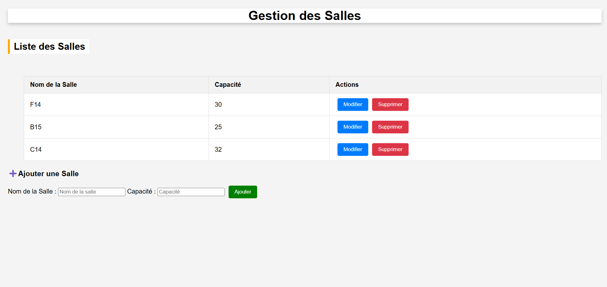
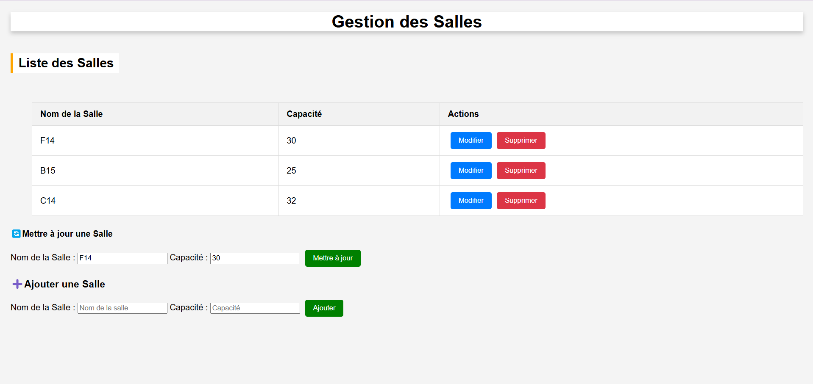

# Gestion des Salles avec Laravel et JavaScript

## Description
Cet exercice permet de créer une application web permettant de gérer des salles (ajout, modification, suppression et affichage). L'API backend est développée avec Laravel, tandis que le frontend utilise JavaScript pour interagir avec l'API via `fetch`.

## Prérequis
- PHP 8+
- Composer
- Laravel 10+
- Node.js (pour le développement frontend si nécessaire)
- MySQL ou SQLite (ou tout autre SGBD compatible avec Laravel)

## Installation

### Backend (Laravel)
1. Cloner le dépôt :
   ```sh
   git https://github.com/Lorraine301/Atelier5_Exercice3_Gestion_des_salles.git
   ```
2. Installer les dépendances Laravel :
   ```sh
   composer install
   ```

3. Exécuter les migrations pour créer la table `rooms` :
   ```sh
   php artisan migrate
   ```
4. Démarrer le serveur Laravel :
   ```sh
   php artisan serve
   ```

### Frontend (JavaScript pur)
1. Ouvrir `index.html` dans un navigateur.
2. Modifier `assets/app.js` pour pointer vers l'URL de l'API si nécessaire (par défaut `http://localhost:8000/api/rooms`).

## Fonctionnalités
- **Afficher les salles** : Liste dynamique des salles existantes.
- **Ajouter une salle** : Formulaire permettant d'ajouter une nouvelle salle.
- **Modifier une salle** : Mise à jour des informations d'une salle existante.
- **Supprimer une salle** : Suppression d'une salle de la base de données.

## Explication du Code

### Backend (Laravel)
#### 1. Migration (`database/migrations/xxxx_xx_xx_create_rooms_table.php`)
Ce fichier définit la structure de la table `rooms` avec les colonnes :
- `id` : Clé primaire auto-incrémentée.
- `name` : Nom de la salle.
- `capacity` : Capacité d'accueil.
- `timestamps` : Gère automatiquement `created_at` et `updated_at`.

#### 2. Modèle (`app/Models/Room.php`)
Le modèle `Room` représente une salle et définit les attributs remplissables (`fillable`).

#### 3. Contrôleur (`app/Http/Controllers/RoomController.php`)
Ce contrôleur implémente les opérations CRUD :
- `index()` : Récupère toutes les salles.
- `show($id)` : Récupère une salle par ID.
- `store(Request $request)` : Valide et crée une nouvelle salle.
- `update(Request $request, $id)` : Modifie une salle existante.
- `destroy($id)` : Supprime une salle.

#### 4. Routes (`routes/api.php`)
Définit les routes RESTful pour accéder aux salles via l'API (`GET`, `POST`, `PUT`, `DELETE`).

### Frontend (JavaScript)
#### 1. `getRooms()`
Récupère toutes les salles et les affiche dynamiquement dans la page HTML.

#### 2. `displayRooms(rooms)`
Affiche la liste des salles sous forme de tableau avec des boutons d'action (modifier/supprimer).

#### 3. `createRoom(name, capacity)`
Envoie une requête `POST` pour ajouter une nouvelle salle.

#### 4. `fillUpdateForm(room)`
Pré-remplit le formulaire de mise à jour avec les informations d'une salle existante.

#### 5. `updateRoom(id, name, capacity)`
Envoie une requête `PUT` pour modifier une salle.

#### 6. `deleteRoom(id)`
Envoie une requête `DELETE` pour supprimer une salle.

## Endpoints de l'API Laravel
| Méthode | Endpoint            | Description               |
|---------|--------------------|---------------------------|
| GET     | `/api/rooms`       | Récupérer toutes les salles |
| GET     | `/api/rooms/{id}`  | Récupérer une salle par ID |
| POST    | `/api/rooms`       | Créer une nouvelle salle |
| PUT     | `/api/rooms/{id}`  | Mettre à jour une salle |
| DELETE  | `/api/rooms/{id}`  | Supprimer une salle |

## Captures d'écran
Voici l'interface utilisateur avec le formulaire de mise à jour caché en premier lieu:



Voici l'interface utilisateur avec le formulaire de mise à jour qui apparaisse quand on clique sur le bouton modifier:



## Auteurs
- **RAHELIARISOA Andriamasy Lorraine Agnès** - Lorraine301


<p align="center"><a href="https://laravel.com" target="_blank"></a></p>

<p align="center">
<a href="https://github.com/laravel/framework/actions"></a>
<a href="https://packagist.org/packages/laravel/framework"></a>
<a href="https://packagist.org/packages/laravel/framework"></a>
<a href="https://packagist.org/packages/laravel/framework"></a>
</p>

## About Laravel

Laravel is a web application framework with expressive, elegant syntax. We believe development must be an enjoyable and creative experience to be truly fulfilling. Laravel takes the pain out of development by easing common tasks used in many web projects, such as:

- [Simple, fast routing engine](https://laravel.com/docs/routing).
- [Powerful dependency injection container](https://laravel.com/docs/container).
- Multiple back-ends for [session](https://laravel.com/docs/session) and [cache](https://laravel.com/docs/cache) storage.
- Expressive, intuitive [database ORM](https://laravel.com/docs/eloquent).
- Database agnostic [schema migrations](https://laravel.com/docs/migrations).
- [Robust background job processing](https://laravel.com/docs/queues).
- [Real-time event broadcasting](https://laravel.com/docs/broadcasting).

Laravel is accessible, powerful, and provides tools required for large, robust applications.

## Learning Laravel

Laravel has the most extensive and thorough [documentation](https://laravel.com/docs) and video tutorial library of all modern web application frameworks, making it a breeze to get started with the framework.

You may also try the [Laravel Bootcamp](https://bootcamp.laravel.com), where you will be guided through building a modern Laravel application from scratch.

If you don't feel like reading, [Laracasts](https://laracasts.com) can help. Laracasts contains thousands of video tutorials on a range of topics including Laravel, modern PHP, unit testing, and JavaScript. Boost your skills by digging into our comprehensive video library.

## Laravel Sponsors

We would like to extend our thanks to the following sponsors for funding Laravel development. If you are interested in becoming a sponsor, please visit the [Laravel Partners program](https://partners.laravel.com).

### Premium Partners

- **[Vehikl](https://vehikl.com/)**
- **[Tighten Co.](https://tighten.co)**
- **[WebReinvent](https://webreinvent.com/)**
- **[Kirschbaum Development Group](https://kirschbaumdevelopment.com)**
- **[64 Robots](https://64robots.com)**
- **[Curotec](https://www.curotec.com/services/technologies/laravel/)**
- **[Cyber-Duck](https://cyber-duck.co.uk)**
- **[DevSquad](https://devsquad.com/hire-laravel-developers)**
- **[Jump24](https://jump24.co.uk)**
- **[Redberry](https://redberry.international/laravel/)**
- **[Active Logic](https://activelogic.com)**
- **[byte5](https://byte5.de)**
- **[OP.GG](https://op.gg)**

## Contributing

Thank you for considering contributing to the Laravel framework! The contribution guide can be found in the [Laravel documentation](https://laravel.com/docs/contributions).

## Code of Conduct

In order to ensure that the Laravel community is welcoming to all, please review and abide by the [Code of Conduct](https://laravel.com/docs/contributions#code-of-conduct).

## Security Vulnerabilities

If you discover a security vulnerability within Laravel, please send an e-mail to Taylor Otwell via [taylor@laravel.com](mailto:taylor@laravel.com). All security vulnerabilities will be promptly addressed.

## License

The Laravel framework is open-sourced software licensed under the [MIT license](https://opensource.org/licenses/MIT).
